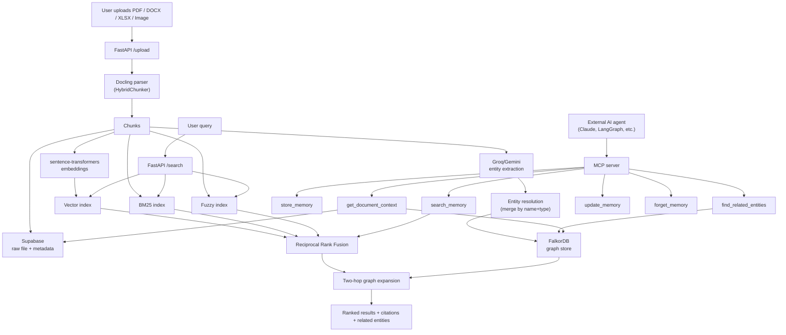

# MemoraGraph

**Private Multimodal AI Memory Infrastructure with MCP**

A reusable personal or organisational memory service that AI assistants can call as a tool — not another chat window. MemoraGraph stores information, retrieves relevant memories via hybrid search, identifies entities and relationships, tracks memory lifecycle (active/outdated/superseded), and exposes all of this through the **Model Context Protocol (MCP)** so external agents (Claude, a LangGraph app, etc.) can use it directly.

## Architecture



## Tech Stack

| Layer | Tool |
|---|---|
| Document parsing | Docling (PDF, DOCX, XLSX, images) |
| Chunking | Docling HybridChunker (tokenizer-aware, structure-aware) |
| Embeddings | sentence-transformers (`all-MiniLM-L6-v2`), fully local |
| Raw storage / metadata | Supabase |
| Graph store | FalkorDB (property graph, OpenCypher) |
| Entity extraction | Groq (Llama 3.3 70B) / Gemini |
| Retrieval | Vector + BM25 + fuzzy, fused via RRF |
| Tool interface | Model Context Protocol (MCP) server |
| Backend | FastAPI |
| Observability | Langfuse tracing |
| Deployment | Docker Compose, GitHub Actions |

## Setup

1. Clone the repo and create a virtualenv:
   ```bash
   python -m venv venv
   venv\Scripts\activate      # Windows
   pip install -r requirements.txt
   ```

2. Copy `.env.example` to `.env` and fill in:
   - `SUPABASE_URL`, `SUPABASE_SECRET_KEY`, `SUPABASE_STORAGE_BUCKET`
   - `FALKORDB_HOST`, `FALKORDB_PORT`, `FALKORDB_PASSWORD`
   - `GROQ_API_KEY` (or `GEMINI_API_KEY`)
   - `LANGFUSE_PUBLIC_KEY`, `LANGFUSE_SECRET_KEY`, `LANGFUSE_HOST`

3. Run the server:
   ```bash
   uvicorn application.main:app --reload
   ```

4. Open `http://localhost:8000/docs` to try `/upload` and `/search`.

## Running the evaluation suite

```bash
python eval/run_eval.py          # Recall@5 / MRR
python eval/accuracy_checks.py   # entity extraction, citation, groundedness
python eval/latency_check.py     # retrieval latency + tool-selection baseline
```

## Running via Docker

```bash
docker compose up --build
```

## MCP Tools Exposed

| Tool | Purpose |
|---|---|
| `store_memory` | Write a new memory (with duplicate detection) |
| `search_memory` | Hybrid search (vector + BM25 + fuzzy, RRF-fused) |
| `find_related_entities` | Two-hop graph expansion around an entity |
| `get_document_context` | Full context on a source document |
| `update_memory` | Versioned update (marks old as superseded) |
| `forget_memory` | Deletion, requires explicit confirmation |

## Project Positioning

MemoraGraph demonstrates reusable AI infrastructure, multimodal ingestion, persistent and temporal memory, MCP server engineering, privacy and permissions, write-time knowledge extraction, and memory lifecycle management.

*Note: "MCP" refers to the open Model Context Protocol specification, not an Anthropic-specific term.*
